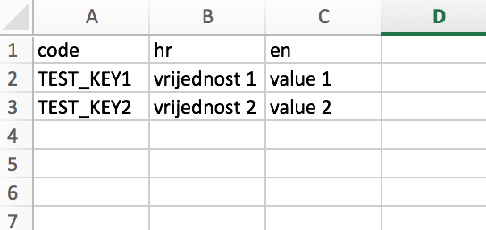

# i18n-xlsx

[](https://travis-ci.org/ivpusic/i18n-xlsx)
[](https://github.com/ellerbrock/open-source-badge/)
[](http://makeapullrequest.com)

Typesafe i18n

This module tries to solve problem of managing i18n data via transpiling excel files with i18n data into
other typesafe formats. Currently supported formats are:

- Typescript
- Go

## Installation

```bash
npm install -g i18n-xlsx
```

## Tutorial (Typescript)

1. Create excel file with i18n data:

Header should contain `code` column and list of supported languages (in this case `hr` and `en`).
Library also supports multiple sheets.



2. Use `i18n-xlsx` to create typescript file

```bash
i18n-xlsx -i translations.xlsx -o i18n.ts
```

Check `i18n.ts` file. It will have following output.

```typescript
interface ISheet1 {
  TEST_KEY1: string;
  TEST_KEY2: string;
}

interface ISheets {
  Sheet1: ISheet1;
}

const all: { [key: string]: ISheets } = {
  hr: {
    Sheet1: {
      TEST_KEY1: 'vrijednost 1',
      TEST_KEY2: 'vrijednost 2',
    },
  },
  en: {
    Sheet1: {
      TEST_KEY1: 'value 1',
      TEST_KEY2: 'value 2',
    },
  },
};

export default all;
```

3. Use generated code

```typescript
import i18n from './path/to/i18n.ts';

console.log(i18n.en.Sheet1.TEST_KEY1); // typesafe + intellisense
```

## License
*MIT*
